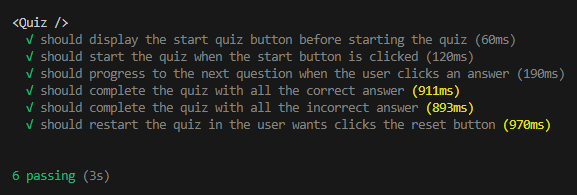
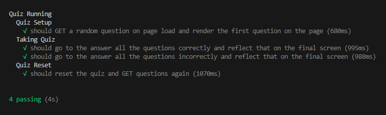

# Tech Quiz

## Description

This project is a tech quiz that asks the user 10 random questions to test their knowledge. After completing the quiz, the user has the option to retake it with a new set of questions. The goal of this project was to integrate Cypress component and end-to-end (e2e) testing into the tech quiz program to ensure it runs smoothly and accurately.

## Table of Contents

- [Installation](#installation)
- [Usage](#usage)
- [Contributing](#contributing)
- [Testing](#testing)
- [Links](#links)

## Installation

To get started with this application, follow these steps:

1. **Clone the Repository**  
   Visit the [GitHub Repository](https://github.com/dolaes/Tech-Quiz) and clone/download the project:

   ```bash
   git clone git@github.com:dolaes/Tech-Quiz.git
   ```

2. **Install Dependencies**  
   Navigate to the project directory and run the following command to install dependencies:

   ```bash
   npm install
   ```

## Usage

Once the dependencies are installed, start the program locally by running:

```bash
npm run start:dev
```

You can use the program in the browser. For testing, it can be run using Cypress or from the command line.

## Contributing

Developed by:  
- Daniel Olaes

Starter code provided by UCI Software Engineering Boot Camp.

## Testing

This project focuses on using Cypress to perform component and end-to-end tests on the Tech Quiz program.

To run the Cypress tests, use:

```bash
npm run test
```

Or to open Cypress manually, use:

```bash
npm run cypress
```

**Watch the Demo Video**:  
Click the images below to see a demo of the application:

[](https://drive.google.com/file/d/1SEvTTyEN8BufN5kvfsTNwldbDUvRt1IF/view?usp=sharing)
[](https://drive.google.com/file/d/1SEvTTyEN8BufN5kvfsTNwldbDUvRt1IF/view?usp=sharing)

## Links

- **GitHub Repository**: [https://github.com/dolaes/Tech-Quiz](https://github.com/dolaes/Tech-Quiz)
